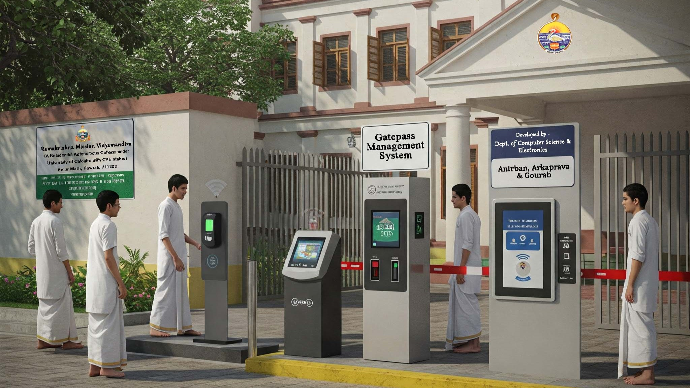

# RFID-Based Gate Pass Management System

This project presents a smart, IoT-enabled Gate Pass Management System tailored for hostels, educational institutions, and gated communities. It integrates RFID technology, Firebase Realtime Database, MySQL, and the ESP32 microcontroller to automate, monitor, and enhance the security of individual entry and exit tracking.

🔗 Repository URL: https://github.com/anirbansantra/Gate-Pass-Management-System

🚀 Features

✅ RFID-Based Entry & Exit Tracking  
✅ Real-Time Authentication via Firebase  
✅ Time-Based Access Rules  
✅ Visual (LED) & Audio (Buzzer) Feedback  
✅ Secure Admin/Warden/Student Dashboards  
✅ Database Logging (Firebase + MySQL)  
✅ Cloud Sync & Remote Monitoring  

🧠 Tech Stack

- ESP32 Microcontroller (C++ / Arduino)
- RFID Reader MFRC522
- Google Firebase Realtime Database (NoSQL)
- MySQL (via XAMPP Local Server)
- PHP + HTML + Bootstrap (Web Portal)
- Wi-Fi Connectivity for Cloud Sync

📦 System Architecture

1. RFID Card Scan → ESP32 reads UID
2. UID checked with Firebase for permissions
3. LEDs & Buzzer respond with access decision
4. Status logged to Firebase & MySQL
5. Web portal allows admin control & tracking

📁 Folder Structure

- /hardware → Circuit diagrams and device code
- /firebase → Firebase rules and structure
- /mysql → SQL dumps for DB setup
- /web → PHP files and web UI
- /docs → Report, screenshots, diagrams

📷 Screenshots

- Student Dashboard  
- Warden Approval Panel  
- Live Entry/Exit Logs  
- Device Setup with ESP32 & RFID Reader

🔐 Access Control Logic

- Entry is granted based on:
  - Time of scan (Current Time)
  - Pre-approved limits (green_led value)
  - Current status (IN/OUT)
- Emergency override and role-based control via web

📚 Setup Instructions

1. Upload ESP32 code via Arduino IDE  
2. Set up Firebase with correct structure and keys  
3. Import MySQL SQL dumps using XAMPP  
4. Configure web portal (htdocs) and database connection  
5. Connect hardware and test RFID scans

📌 Requirements

- ESP32 Dev Board  
- MFRC522 RFID Reader  
- RFID Tags  
- Firebase Project (Realtime DB)  
- XAMPP Server (Apache + MySQL)  
- PHP 7.x+  
- WiFi Connectivity  

📞 Contact

Made with ❤️ by anirbansantra  & friends
🔗 GitHub: https://github.com/anirbansantra  
📧 Email: anirbansantraofficial@gmail.com

📃 License

This project is licensed under the MIT License — feel free to use and modify with attribution.

Let me know if you want a badge or markdown style with emoji, diagram image links, or contributors section!
